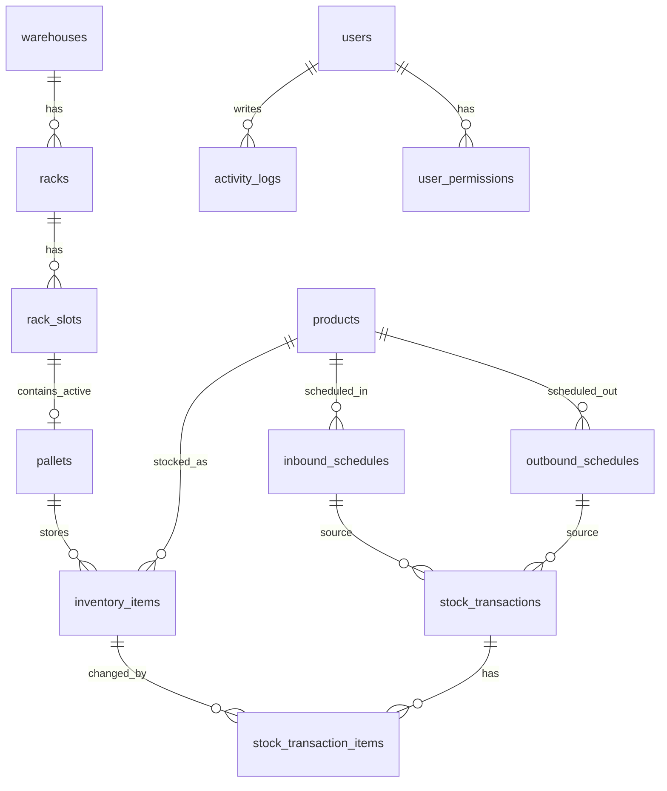

# YNK WMS DB 설계안 (MySQL)

작성 기준: 현재 React 데모(`useDataStore`)와 서비스 문서의 웹/태블릿/키오스크 흐름  
대상 DB: MySQL 8.0 이상, InnoDB, `utf8mb4`

ER 다이어그램용 DBML: [`docs/dbdiagram.dbml`](dbdiagram.dbml)을 https://dbdiagram.io/ 에 붙여 넣으면 된다.

## 1. 설계 방향

현재 데모의 핵심 데이터는 `warehouses -> racks -> slots -> pallets -> inventory_items -> products` 구조다. 데모에서는 팔레트 위치가 `"rackId-floor-slot"` 문자열로 저장되지만, 실제 DB에서는 위치를 `rack_slots` 테이블로 정규화한다.

입고/출고는 예정 등록 후 실행되는 구조이므로, 예정(`*_schedules`)은 분리하고 실행 이력은 `stock_transactions` 한 테이블에서 함께 관리한다. 출고는 `received_at` 오름차순 FIFO 기준으로 `inventory_items`를 차감하고, 차감 상세는 `stock_transaction_items`에 남긴다.

재고 현재값은 `inventory_items.quantity`에 두고, 감사/복구/추적 기준은 `stock_transactions`와 `stock_transaction_items`를 사용한다. 키오스크/전동랙 상태는 장비 이벤트로 별도 저장한다.

## 2. 주요 엔티티

| 영역 | 테이블 | 역할 |
|---|---|---|
| 기준정보 | `warehouses` | 창고 마스터. 일반/전동랙 구분 |
| 기준정보 | `racks` | 창고별 랙 마스터 |
| 기준정보 | `rack_slots` | 랙 내부 위치. 데모의 `floor`, `slot` |
| 기준정보 | `products` | 상품/원부자재 마스터 |
| 재고 | `pallets` | 슬롯에 적재되는 팔레트. 슬롯당 최대 1개 활성 팔레트 |
| 재고 | `inventory_items` | 팔레트 내 재고 로트. 입고일/유통기한별 분리 |
| 입고 | `inbound_schedules` | 입고 예정 |
| 출고 | `outbound_schedules` | 출고 예정 |
| 이력 | `stock_transactions` | 입고/출고/이동/조정 실행 이력 헤더 |
| 이력 | `stock_transaction_items` | 실행 이력 상세. 출고 FIFO 차감 로트 포함 |
| 사용자 | `users` | 계정 |
| 사용자 | `user_permissions` | 창고/기능/액션 단위 권한 |
| 로그 | `activity_logs` | 화면 활동 로그 |
| 장비 | `devices` | 키오스크/태블릿/전동랙 장비 |
| 장비 | `device_events` | 블루투스/장비 상태 이벤트 |

## 3. 관계 요약



## 4. MySQL DDL 초안

```sql
create table warehouses (
  id bigint unsigned not null auto_increment,
  name varchar(100) not null,
  type enum('normal', 'electric') not null default 'normal',
  max_rack_count int unsigned null,
  is_active tinyint(1) not null default 1,
  created_at datetime(3) not null default current_timestamp(3),
  updated_at datetime(3) not null default current_timestamp(3) on update current_timestamp(3),
  primary key (id)
) engine=InnoDB default charset=utf8mb4 collate=utf8mb4_unicode_ci;

create table racks (
  id bigint unsigned not null auto_increment,
  warehouse_id bigint unsigned not null,
  rack_no int unsigned not null,
  floor_count int unsigned not null,
  slots_per_floor int unsigned not null,
  is_active tinyint(1) not null default 1,
  created_at datetime(3) not null default current_timestamp(3),
  updated_at datetime(3) not null default current_timestamp(3) on update current_timestamp(3),
  primary key (id),
  unique key uq_racks_warehouse_rack_no (warehouse_id, rack_no),
  constraint fk_racks_warehouse foreign key (warehouse_id) references warehouses(id),
  constraint chk_racks_floor_count check (floor_count > 0),
  constraint chk_racks_slots_per_floor check (slots_per_floor > 0)
) engine=InnoDB default charset=utf8mb4 collate=utf8mb4_unicode_ci;

create table rack_slots (
  id bigint unsigned not null auto_increment,
  rack_id bigint unsigned not null,
  floor_no int unsigned not null,
  slot_no int unsigned not null,
  barcode varchar(80) null,
  is_blocked tinyint(1) not null default 0,
  created_at datetime(3) not null default current_timestamp(3),
  primary key (id),
  unique key uq_rack_slots_position (rack_id, floor_no, slot_no),
  unique key uq_rack_slots_barcode (barcode),
  constraint fk_rack_slots_rack foreign key (rack_id) references racks(id),
  constraint chk_rack_slots_floor_no check (floor_no > 0),
  constraint chk_rack_slots_slot_no check (slot_no > 0)
) engine=InnoDB default charset=utf8mb4 collate=utf8mb4_unicode_ci;

create table products (
  id bigint unsigned not null auto_increment,
  code varchar(80) not null,
  name varchar(255) not null,
  description text null,
  category varchar(100) null,
  unit varchar(20) not null default 'ea',
  is_active tinyint(1) not null default 1,
  created_at datetime(3) not null default current_timestamp(3),
  updated_at datetime(3) not null default current_timestamp(3) on update current_timestamp(3),
  deleted_at datetime(3) null,
  primary key (id),
  unique key uq_products_code (code),
  key idx_products_category (category)
) engine=InnoDB default charset=utf8mb4 collate=utf8mb4_unicode_ci;

create table pallets (
  id bigint unsigned not null auto_increment,
  code varchar(80) null,
  rack_slot_id bigint unsigned not null,
  status enum('active', 'moved', 'disposed') not null default 'active',
  active_slot_id bigint unsigned generated always as (
    case when status = 'active' then rack_slot_id else null end
  ) stored,
  created_at datetime(3) not null default current_timestamp(3),
  updated_at datetime(3) not null default current_timestamp(3) on update current_timestamp(3),
  primary key (id),
  unique key uq_pallets_code (code),
  unique key uq_pallets_one_active_per_slot (active_slot_id),
  key idx_pallets_rack_slot (rack_slot_id),
  constraint fk_pallets_rack_slot foreign key (rack_slot_id) references rack_slots(id)
) engine=InnoDB default charset=utf8mb4 collate=utf8mb4_unicode_ci;

create table inventory_items (
  id bigint unsigned not null auto_increment,
  code varchar(80) not null,
  product_id bigint unsigned not null,
  pallet_id bigint unsigned not null,
  quantity decimal(14,3) not null,
  received_at date not null,
  expiration_date date null,
  production_date date null,
  lot_no varchar(100) null,
  created_at datetime(3) not null default current_timestamp(3),
  updated_at datetime(3) not null default current_timestamp(3) on update current_timestamp(3),
  primary key (id),
  unique key uq_inventory_items_code (code),
  key idx_inventory_product_fifo (product_id, received_at, id),
  key idx_inventory_pallet (pallet_id),
  constraint fk_inventory_items_product foreign key (product_id) references products(id),
  constraint fk_inventory_items_pallet foreign key (pallet_id) references pallets(id),
  constraint chk_inventory_items_quantity check (quantity >= 0)
) engine=InnoDB default charset=utf8mb4 collate=utf8mb4_unicode_ci;

create table users (
  id bigint unsigned not null auto_increment,
  name varchar(80) not null,
  email varchar(255) not null,
  password_hash varchar(255) not null,
  role enum('developer', 'super_admin', 'admin', 'user') not null default 'user',
  is_approved tinyint(1) not null default 0,
  last_login_at datetime(3) null,
  created_at datetime(3) not null default current_timestamp(3),
  updated_at datetime(3) not null default current_timestamp(3) on update current_timestamp(3),
  primary key (id),
  unique key uq_users_email (email)
) engine=InnoDB default charset=utf8mb4 collate=utf8mb4_unicode_ci;

create table inbound_schedules (
  id bigint unsigned not null auto_increment,
  product_id bigint unsigned not null,
  quantity decimal(14,3) not null,
  scheduled_date date not null,
  status enum('pending', 'done', 'cancelled') not null default 'pending',
  supplier_name varchar(150) null,
  note text null,
  created_by bigint unsigned null,
  created_at datetime(3) not null default current_timestamp(3),
  updated_at datetime(3) not null default current_timestamp(3) on update current_timestamp(3),
  primary key (id),
  key idx_inbound_schedules_status_date (status, scheduled_date),
  key idx_inbound_schedules_product (product_id),
  constraint fk_inbound_schedules_product foreign key (product_id) references products(id),
  constraint fk_inbound_schedules_created_by foreign key (created_by) references users(id),
  constraint chk_inbound_schedules_quantity check (quantity > 0)
) engine=InnoDB default charset=utf8mb4 collate=utf8mb4_unicode_ci;

create table outbound_schedules (
  id bigint unsigned not null auto_increment,
  product_id bigint unsigned not null,
  quantity decimal(14,3) not null,
  scheduled_date date not null,
  status enum('pending', 'done', 'cancelled') not null default 'pending',
  customer_name varchar(150) null,
  note text null,
  created_by bigint unsigned null,
  created_at datetime(3) not null default current_timestamp(3),
  updated_at datetime(3) not null default current_timestamp(3) on update current_timestamp(3),
  primary key (id),
  key idx_outbound_schedules_status_date (status, scheduled_date),
  key idx_outbound_schedules_product (product_id),
  constraint fk_outbound_schedules_product foreign key (product_id) references products(id),
  constraint fk_outbound_schedules_created_by foreign key (created_by) references users(id),
  constraint chk_outbound_schedules_quantity check (quantity > 0)
) engine=InnoDB default charset=utf8mb4 collate=utf8mb4_unicode_ci;

create table stock_transactions (
  id bigint unsigned not null auto_increment,
  transaction_type enum('inbound', 'outbound', 'move', 'adjustment') not null,
  inbound_schedule_id bigint unsigned null,
  outbound_schedule_id bigint unsigned null,
  product_id bigint unsigned not null,
  total_quantity decimal(14,3) not null,
  note text null,
  processed_by bigint unsigned null,
  processed_at datetime(3) not null default current_timestamp(3),
  created_at datetime(3) not null default current_timestamp(3),
  primary key (id),
  key idx_stock_transactions_processed_at (processed_at),
  key idx_stock_transactions_type_processed_at (transaction_type, processed_at),
  key idx_stock_transactions_product_processed_at (product_id, processed_at),
  key idx_stock_transactions_inbound_schedule (inbound_schedule_id),
  key idx_stock_transactions_outbound_schedule (outbound_schedule_id),
  constraint fk_stock_transactions_inbound_schedule foreign key (inbound_schedule_id) references inbound_schedules(id),
  constraint fk_stock_transactions_outbound_schedule foreign key (outbound_schedule_id) references outbound_schedules(id),
  constraint fk_stock_transactions_product foreign key (product_id) references products(id),
  constraint fk_stock_transactions_processed_by foreign key (processed_by) references users(id),
  constraint chk_stock_transactions_total_quantity check (total_quantity > 0),
  constraint chk_stock_transactions_schedule_ref check (
    (transaction_type = 'inbound' and inbound_schedule_id is not null and outbound_schedule_id is null)
    or (transaction_type = 'outbound' and outbound_schedule_id is not null and inbound_schedule_id is null)
    or (transaction_type in ('move', 'adjustment') and inbound_schedule_id is null and outbound_schedule_id is null)
  )
) engine=InnoDB default charset=utf8mb4 collate=utf8mb4_unicode_ci;

create table stock_transaction_items (
  id bigint unsigned not null auto_increment,
  stock_transaction_id bigint unsigned not null,
  inventory_item_id bigint unsigned null,
  pallet_id bigint unsigned not null,
  from_rack_slot_id bigint unsigned null,
  to_rack_slot_id bigint unsigned null,
  quantity decimal(14,3) not null,
  quantity_delta decimal(14,3) not null,
  fifo_rank int unsigned null,
  primary key (id),
  key idx_stock_transaction_items_transaction (stock_transaction_id),
  key idx_stock_transaction_items_inventory_item (inventory_item_id),
  key idx_stock_transaction_items_pallet (pallet_id),
  constraint fk_stock_transaction_items_transaction foreign key (stock_transaction_id) references stock_transactions(id) on delete cascade,
  constraint fk_stock_transaction_items_inventory_item foreign key (inventory_item_id) references inventory_items(id),
  constraint fk_stock_transaction_items_pallet foreign key (pallet_id) references pallets(id),
  constraint fk_stock_transaction_items_from_slot foreign key (from_rack_slot_id) references rack_slots(id),
  constraint fk_stock_transaction_items_to_slot foreign key (to_rack_slot_id) references rack_slots(id),
  constraint chk_stock_transaction_items_quantity check (quantity > 0),
  constraint chk_stock_transaction_items_quantity_delta check (quantity_delta <> 0),
  constraint chk_stock_transaction_items_fifo_rank check (fifo_rank is null or fifo_rank > 0)
) engine=InnoDB default charset=utf8mb4 collate=utf8mb4_unicode_ci;

create table user_permissions (
  id bigint unsigned not null auto_increment,
  user_id bigint unsigned not null,
  warehouse_id bigint unsigned null,
  feature enum(
    'dashboard',
    'inbound_schedule',
    'inbound_execute',
    'outbound_schedule',
    'outbound_execute',
    'inventory',
    'products',
    'activity_log',
    'users',
    'settings'
  ) not null,
  actions json not null,
  warehouse_scope_id bigint unsigned generated always as (coalesce(warehouse_id, 0)) stored,
  created_at datetime(3) not null default current_timestamp(3),
  primary key (id),
  unique key uq_user_permissions_scope (user_id, warehouse_scope_id, feature),
  key idx_user_permissions_warehouse (warehouse_id),
  constraint fk_user_permissions_user foreign key (user_id) references users(id) on delete cascade,
  constraint fk_user_permissions_warehouse foreign key (warehouse_id) references warehouses(id),
  constraint chk_user_permissions_actions check (json_valid(actions))
) engine=InnoDB default charset=utf8mb4 collate=utf8mb4_unicode_ci;

create table activity_logs (
  id bigint unsigned not null auto_increment,
  user_id bigint unsigned null,
  user_name_snapshot varchar(80) null,
  action varchar(80) not null,
  feature enum(
    'dashboard',
    'inbound_schedule',
    'inbound_execute',
    'outbound_schedule',
    'outbound_execute',
    'inventory',
    'products',
    'activity_log',
    'users',
    'settings'
  ) null,
  target_table varchar(80) null,
  target_id bigint unsigned null,
  detail text null,
  payload json null,
  ip varchar(45) null,
  created_at datetime(3) not null default current_timestamp(3),
  primary key (id),
  key idx_activity_logs_created_at (created_at),
  key idx_activity_logs_feature_created_at (feature, created_at),
  key idx_activity_logs_user_created_at (user_id, created_at),
  constraint fk_activity_logs_user foreign key (user_id) references users(id),
  constraint chk_activity_logs_payload check (payload is null or json_valid(payload))
) engine=InnoDB default charset=utf8mb4 collate=utf8mb4_unicode_ci;

create table devices (
  id bigint unsigned not null auto_increment,
  code varchar(80) not null,
  name varchar(120) not null,
  type enum('kiosk', 'tablet', 'electric_rack', 'bluetooth_gateway') not null,
  warehouse_id bigint unsigned null,
  rack_id bigint unsigned null,
  status enum('connected', 'retrying', 'failed', 'offline') not null default 'offline',
  last_seen_at datetime(3) null,
  meta json not null,
  created_at datetime(3) not null default current_timestamp(3),
  updated_at datetime(3) not null default current_timestamp(3) on update current_timestamp(3),
  primary key (id),
  unique key uq_devices_code (code),
  key idx_devices_warehouse (warehouse_id),
  key idx_devices_rack (rack_id),
  constraint fk_devices_warehouse foreign key (warehouse_id) references warehouses(id),
  constraint fk_devices_rack foreign key (rack_id) references racks(id),
  constraint chk_devices_meta check (json_valid(meta))
) engine=InnoDB default charset=utf8mb4 collate=utf8mb4_unicode_ci;

create table device_events (
  id bigint unsigned not null auto_increment,
  device_id bigint unsigned not null,
  status enum('connected', 'retrying', 'failed', 'offline') null,
  event_type varchar(80) not null,
  message text null,
  payload json null,
  created_at datetime(3) not null default current_timestamp(3),
  primary key (id),
  key idx_device_events_device_created_at (device_id, created_at),
  key idx_device_events_created_at (created_at),
  constraint fk_device_events_device foreign key (device_id) references devices(id) on delete cascade,
  constraint chk_device_events_payload check (payload is null or json_valid(payload))
) engine=InnoDB default charset=utf8mb4 collate=utf8mb4_unicode_ci;
```

## 5. MySQL 설계 메모

- MySQL에는 PostgreSQL의 partial unique index가 없으므로 `pallets.active_slot_id` 생성 컬럼으로 `status = 'active'`인 팔레트만 슬롯당 1개가 되도록 제한한다.
- `user_permissions.warehouse_id`는 `NULL`일 때 전체 창고 권한을 의미한다. MySQL unique key는 `NULL` 중복을 허용하므로 `warehouse_scope_id = coalesce(warehouse_id, 0)` 생성 컬럼으로 중복을 막는다.
- `JSON` 컬럼은 MySQL에서 내부적으로 JSON 유효성을 검증하지만, 명시성을 위해 `check (json_valid(...))`를 남겼다.
- `CHECK` 제약은 MySQL 8.0.16 이상에서 적용된다. 그 이전 버전을 써야 한다면 애플리케이션 검증이나 트리거로 대체해야 한다.
- `datetime(3)`는 밀리초 단위 기록을 위한 선택이다. 초 단위만 필요하면 `datetime`으로 낮춰도 된다.

## 6. 데모 데이터 매핑

| 데모 필드 | DB 필드 |
|---|---|
| `warehouses.id/name/type/max_rack_count` | `warehouses.*` |
| `racks.warehouse_id/rack_no/floors/groups` | `racks.warehouse_id/rack_no/floor_count/slots_per_floor` |
| `pallets.location = "rackId-floor-slot"` | `rack_slots(rack_id, floor_no, slot_no)` + `pallets.rack_slot_id` |
| `products.code/name/description/category/created_at` | `products.code/name/description/category/created_at` |
| `inventoryItems.code/product_id/pallet_id/quantity/received_at/expiration_date` | `inventory_items.*` |
| `inboundSchedules.note` | `supplier_name` 또는 `note` |
| `outboundSchedules.note` | `customer_name` 또는 `note` |
| `activityLogs.user/detail` | `user_name_snapshot/detail` |

## 7. 핵심 쿼리

### 재고 리스트: 상품별 합산

```sql
select
  p.id,
  p.code,
  p.name,
  p.category,
  coalesce(sum(i.quantity), 0) as total_quantity,
  count(distinct case when i.quantity > 0 then i.pallet_id end) as location_count
from products p
left join inventory_items i
  on i.product_id = p.id
 and i.quantity > 0
where p.deleted_at is null
group by p.id, p.code, p.name, p.category
order by p.code;
```

### 상품별 위치 상세

```sql
select
  i.id,
  i.code as inventory_code,
  i.quantity,
  i.received_at,
  i.expiration_date,
  w.name as warehouse_name,
  r.rack_no,
  s.floor_no,
  s.slot_no
from inventory_items i
join pallets pl on pl.id = i.pallet_id
join rack_slots s on s.id = pl.rack_slot_id
join racks r on r.id = s.rack_id
join warehouses w on w.id = r.warehouse_id
where i.product_id = ?
  and i.quantity > 0
order by i.received_at, i.id;
```

### 출고 FIFO 후보

```sql
select
  i.id,
  i.code,
  i.quantity,
  i.received_at,
  i.expiration_date,
  pl.id as pallet_id,
  s.id as rack_slot_id,
  w.id as warehouse_id,
  r.rack_no,
  s.floor_no,
  s.slot_no
from inventory_items i
join pallets pl on pl.id = i.pallet_id
join rack_slots s on s.id = pl.rack_slot_id
join racks r on r.id = s.rack_id
join warehouses w on w.id = r.warehouse_id
where i.product_id = ?
  and i.quantity > 0
order by i.received_at asc, i.id asc
for update skip locked;
```

### 입출고 이력 목록: 한 테이블에서 조회

```sql
select
  t.id,
  t.transaction_type,
  t.total_quantity,
  t.processed_at,
  p.code as product_code,
  p.name as product_name,
  u.name as processed_by_name,
  coalesce(is1.supplier_name, os1.customer_name) as partner_name,
  coalesce(is1.note, os1.note, t.note) as note
from stock_transactions t
join products p on p.id = t.product_id
left join users u on u.id = t.processed_by
left join inbound_schedules is1 on is1.id = t.inbound_schedule_id
left join outbound_schedules os1 on os1.id = t.outbound_schedule_id
where t.transaction_type in ('inbound', 'outbound')
order by t.processed_at desc, t.id desc;
```

## 8. 처리 트랜잭션 규칙

### 입고 실행

1. `start transaction`을 시작한다.
2. `inbound_schedules`를 `for update`로 조회하고 `status = 'pending'`인지 확인한다.
3. 선택 슬롯의 활성 팔레트를 조회한다. 없으면 `pallets`를 생성한다.
4. `inventory_items`를 생성한다. 같은 상품이라도 입고일 또는 로트가 다르면 별도 레코드로 둔다.
5. `stock_transactions`에 `transaction_type = 'inbound'`, `inbound_schedule_id`, `total_quantity`를 기록한다.
6. `stock_transaction_items`에 생성된 `inventory_item_id`, `pallet_id`, `to_rack_slot_id`, `quantity_delta > 0`을 기록한다.
7. `inbound_schedules.status = 'done'`으로 갱신한다.
8. developer가 아닌 사용자라면 `activity_logs`를 기록한다.
9. `commit`한다.

### 출고 실행

1. `start transaction`을 시작한다.
2. `outbound_schedules`를 `for update`로 조회하고 `status = 'pending'`인지 확인한다.
3. `inventory_items`를 `product_id, received_at, id` 순으로 `for update skip locked` 조회한다.
4. 요청 수량을 채울 때까지 FIFO 차감 계획을 만든다.
5. 재고가 부족하면 전체 트랜잭션을 `rollback`한다.
6. `stock_transactions`에 `transaction_type = 'outbound'`, `outbound_schedule_id`, `total_quantity`를 기록한다.
7. 각 `inventory_items.quantity`를 차감한다.
8. 차감한 각 로트별로 `stock_transaction_items`에 `inventory_item_id`, `pallet_id`, `from_rack_slot_id`, `quantity_delta < 0`, `fifo_rank`를 기록한다.
9. `outbound_schedules.status = 'done'`으로 갱신한다.
10. developer가 아닌 사용자라면 `activity_logs`를 기록한다.
11. `commit`한다.

## 9. 운영상 권장사항

- `rack_slots`는 랙 생성 시 `floor_count * slots_per_floor`만큼 선생성하는 방식이 UI 매트릭스 렌더링에 가장 단순하다.
- `inventory_items.quantity = 0`인 로트는 삭제하지 말고 유지한다. 출고 이력과 FIFO 감사 추적에 필요하다.
- 재고 이동은 `pallets.rack_slot_id`를 갱신하고 `stock_transactions.transaction_type = 'move'`와 `stock_transaction_items`의 `from_rack_slot_id`, `to_rack_slot_id`로 남긴다.
- 수량 조정은 `inventory_items.quantity` 직접 갱신과 함께 `stock_transactions.transaction_type = 'adjustment'`와 `stock_transaction_items.quantity_delta`로 남긴다.
- 입고/출고 이력 목록 화면은 `stock_transactions`만 조회하고, 특정 이력 상세 화면에서 `stock_transaction_items`를 조회하는 구성이 가장 단순하다.
- 키오스크의 실시간 로그는 `activity_logs`와 `device_events`를 합쳐 조회하되, 운영 이벤트와 장비 이벤트는 저장 테이블을 분리한다.
- 태블릿/키오스크도 실서비스에서는 `devices` 등록 및 토큰 기반 인증을 붙이는 편이 좋다.
